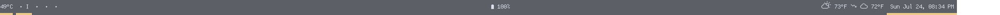

# Polybar Xbox One Controller Status

Requirements:
- upower
- xone
- font with battery icons

A bad module for keeping track of your Xbox One controller battery status.  
I use Cozette as my font, which includes battery status indicator icons. You may need to copy in your own indicator icons from the font of your choosing.

Here's an example module config:

```
[module/xbox]
interval = 30
type = custom/script
exec = ${HOME}/.config/polybar/polybar_scripts/polybar-controller-power.sh
format = "<label>"
```

Here's a screenshot of the module in action. It's the center module.  

